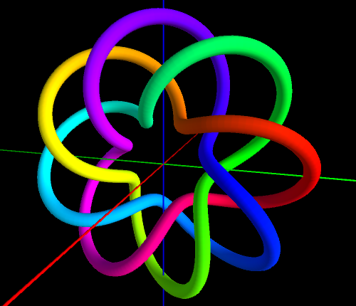
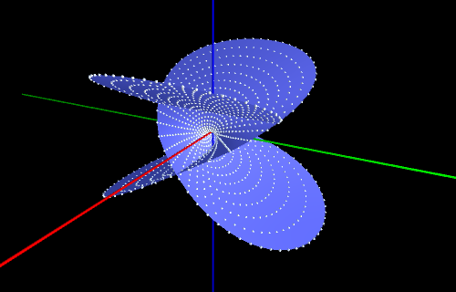

[Home](../)

# **Tutorial**

UnityCindy3D runs on [CindyScript](https://doc.cinderella.de/tiki-index.php?page=CindyScript), which is the scripting language of the [Cinderella](https://www.cinderella.de/).

Also, UnityCindy3D uses some 3D drawing functions that are basically compatible with the [Cindy3D](http://gagern.github.io/Cindy3D/).
The compatible list of the functions is [Here](./compatiblelist.pdf). The funtions in the yellow cells are extexded drawing functions. To use them, follow the comments beside the each row.

## Installation

1. Download a binary package depending on your platform from the [Downloads page](https://github.com/tmytokai/UnityCindy3D/tree/master/Downloads/).
1. After extracting the package, move UnityCindy3D folder into the Plugins folder of the Cinderella.

## Getting Started

1. Launch the Cinderella.
1. Open the Script Editor.
1. Open the Initialization slot, and copy the following code.

    ```
    use( "UnityCindy3D" );
    ```

1. The graphic viewer does not appear automatically for now :-( So launch the viewer manually from the Plugins folder of the Cinderella.

## How to draw a point

1. Open the Draw slot, and copy the following code.

    ```
    begin3d();  

    // draws axes
    draw3d([-5,0,0],[5,0,0],color->[1,0,0],size->0.3); //x  
    draw3d([0,-5,0],[0,5,0],color->[0,1,0],size->0.3); //y  
    draw3d([0,0,-5],[0,0,5],color->[0,0,1],size->0.3); //z  
    color3d([1,1,1]);  

    // draws a point
    draw3d([2,0,1]);
    
    end3d()  
    ```

1. Push the start button on the right-upper side of the editor.

## How to draw a segment

1. Open the Draw slot, and copy the following code.

    ```
    begin3d();  

    // draws axes
    draw3d([-5,0,0],[5,0,0],color->[1,0,0],size->0.3); //x  
    draw3d([0,-5,0],[0,5,0],color->[0,1,0],size->0.3); //y  
    draw3d([0,0,-5],[0,0,5],color->[0,0,1],size->0.3); //z  
    color3d([1,1,1]);  

    // draws a segment
    draw3d([0,0,0],[2,0,1]);

    //end3d()  
    ```

1. Push the start button on the right-upper side of the editor.

## How to draw polygons

1. Open the Draw slot, and copy the following code.

    ```
    begin3d();  

    // draws axes
    draw3d([-5,0,0],[5,0,0],color->[1,0,0],size->0.3); //x  
    draw3d([0,-5,0],[0,5,0],color->[0,1,0],size->0.3); //y  
    draw3d([0,0,-5],[0,0,5],color->[0,0,1],size->0.3); //z  
    color3d([1,1,1]);  

    // draws polygons
    A=[2,0,0];   
    B=[0,2,0];   
    C=[-2,0,0];   
    D=[0,0,2];   
    fillpoly3d([A,B,D]);   
    fillpoly3d([B,C,D]);   

    //end3d()  
    ```

1. Push the start button on the right-upper side of the editor.

## How to draw a sphere

1. Open the Draw slot, and copy the following code.

    ```
    begin3d();  

    // draws axes
    draw3d([-5,0,0],[5,0,0],color->[1,0,0],size->0.3); //x  
    draw3d([0,-5,0],[0,5,0],color->[0,1,0],size->0.3); //y  
    draw3d([0,0,-5],[0,0,5],color->[0,0,1],size->0.3); //z  
    color3d([1,1,1]);  

    // draws a sphere
    drawsphere3d([0,0,0],2);

    end3d()  
    ```

1. Push the start button on the right-upper side of the editor.

## How to draw a curved surface 

1. Open the Draw slot, and copy the following code.

    ```
    begin3d();  

    // draws axes
    draw3d([-5,0,0],[5,0,0],color->[1,0,0],size->0.3); //x  
    draw3d([0,-5,0],[0,5,0],color->[0,1,0],size->0.3); //y  
    draw3d([0,0,-5],[0,0,5],color->[0,0,1],size->0.3); //z  
    color3d([1,1,1]);  

    // draws a curved surface (saddle surface)
    m=apply(-20..20,ii,x=ii/10;   
      apply(-20..20,jj,y=jj/10;   
      z=(x^2-y^2)/2;   
      (x,y,z)));   
    m=flatten(m,level->1);   
    mesh3d(41,41,m);

    end3d()  
    ```

1. Push the start button on the right-upper side of the editor.

## Example 1: Torus knot

As a first example, let's draw a [Torus knot](https://en.wikipedia.org/wiki/Torus_knot).



1. Open the Draw slot, and copy the following code.

    ```
    begin3d();  

    // draws axes
    draw3d([-5,0,0],[5,0,0],color->[1,0,0],size->0.3); //x  
    draw3d([0,-5,0],[0,5,0],color->[0,1,0],size->0.3); //y  
    draw3d([0,0,-5],[0,0,5],color->[0,0,1],size->0.3); //z  
    color3d([1,1,1]);  

    // draws a Torus knot (p,q)
    n=600; 
    p=3; 
    q=8; 
    pt=apply(0..n-1,i, w =i/n*2*pi; 
      r=cos(q*w)+2; 
      ( sin(q*w), r * cos(p*w), r * sin(p*w) ) ); 
    cl=apply(0..n,i, hue( i/n ); ); 
    colorconnect3d(pt,cl,size->3,topology->"close");

    end3d()  
    ```

1. Push the start button on the right-upper side of the editor.
1. The above object will appear on the viewer.
1. Change p and q as you like and enjoy the change of the shape !

## Example 2: Enneper surface

Next, let's draw a [Enneper surface](https://en.wikipedia.org/wiki/Enneper_surface).



1. Open the Draw slot, and copy the following code.

    ```
    begin3d();  

    // draws axes
    draw3d([-5,0,0],[5,0,0],color->[1,0,0],size->0.3); //x  
    draw3d([0,-5,0],[0,5,0],color->[0,1,0],size->0.3); //y  
    draw3d([0,0,-5],[0,0,5],color->[0,0,1],size->0.3); //z  
    color3d([1,1,1]);  

    // draws a Enneper surface
    m=apply(-20..20,ii,u=ii/10;   
      apply(-20..20,jj,v=jj/10;   
      x = u * (1-u*u+v*v)/3;
      y = -v * (1-v*v+u*u)/3;
      z=(u*u-v*v)/3; 
      (x,y,z)));   
    m=flatten(m,level->1);
    forall(m,draw3d(#,size->0.4));
    mesh3d(41,41,m,color->(0.5,0.5,1.0));

    end3d()
    ```

1. Push the start button on the right-upper side of the editor.
1. The above object will appear on the viewer.
1. Rotate the viewer and watch the strange shape of the object !

